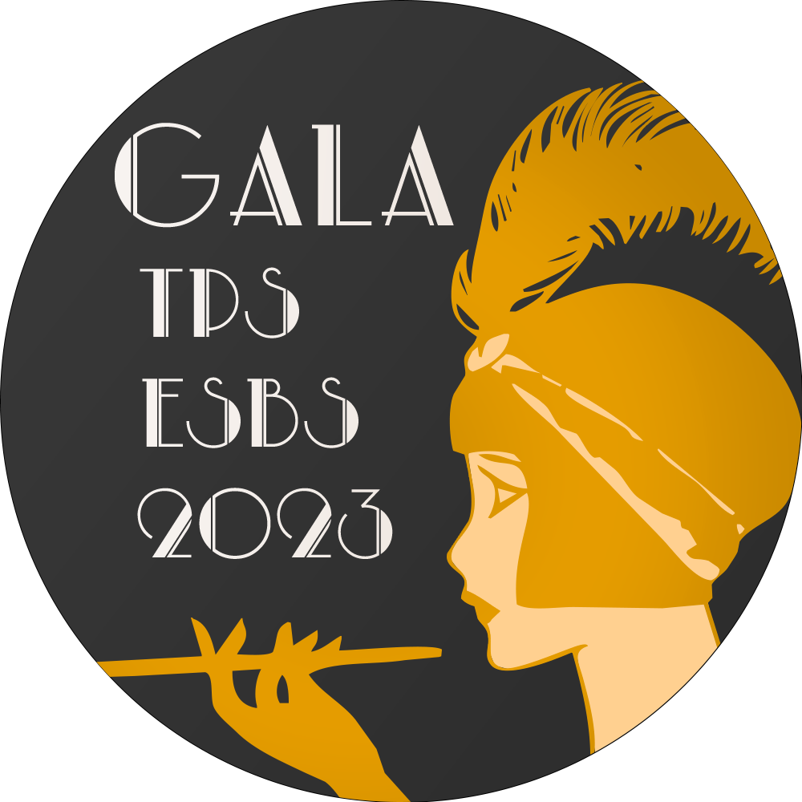
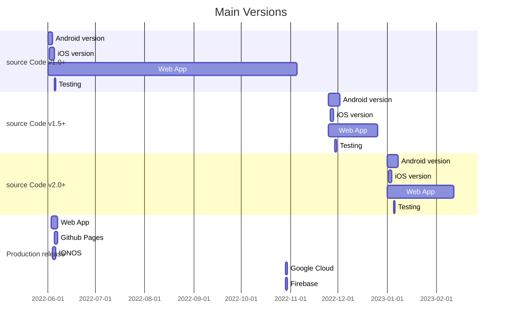

#  galapsbs

> The source code of the Gala 2023 Web App

[](https://docs.microsoft.com/en-us/windows/wsl/tutorials/gui-apps)
[](https://svgshare.com/i/ZhY.svg)
[](https://github.com/ThomasByr/galapsbs/blob/master/LICENSE)
[](https://GitHub.com/ThomasByr/galapsbs/commit/)
[](https://gitHub.com/ThomasByr/galapsbs/commit/)
[](https://GitHub.com/ThomasByr/galapsbs/graphs/commit-activity)

[](https://github.com/ThomasByr/galapsbs)
[](https://github.com/ThomasByr)
[](https://github.com/LosKeeper)

1. [✏️ In short](#️-in-short)
2. [👩‍🏫 Usage](#-usage)
3. [💁 Get Help](#-get-help)
4. [🔰 Support](#-support)
5. [⚖️ License](#️-license)
6. [🔄 Changelog](#-changelog)
7. [🐛 Bugs and TODO](#-bugs-and-todo)

## ✏️ In short

> **Warning**
> This repo is supposed to be private. It could leave this state though for showcase purposes. If you ever get access to it please do not steal all the hard work !
>
> **We are definitively closing maintenance for this App. This repo will be archived soon.**

This repo contains all the source code and assets of the 2023 Gala Web App hosted by [Télécom Physique Strasbourg](https://www.telecom-physique.fr/). There are two (main) branches here :

- `master` which holds the said source code
- `gh-pages` which is an _up-to-date_ clone of the [`./build/web`](build/web/) folder

Normally, you would find a release version of the web app running by [galapsbs.fr](https://galapsbs.fr) hosted by [ionos](https://www.ionos.com/). Alternatively, find a local version running by [Github Pages](https://thomasbyr.github.io/galapsbs/).

## 👩‍🏫 Usage

Please make sure you have installed the required dependencies with :

```ps1
flutter pub get
```

Run a production version with the device of your choice with :

```ps1
flutter run -d <device> --release --web-renderer canvaskit
```

> **Note**
> Since some animations can be pretty heavy for some devices, we will use canvaskit as the renderer ; please make sure you load the web app with a WASM enabled browser !

## 💁 Get Help

> [~~file a new issue~~](https://github.com/ThomasByr/galapsbs/issues/new)

This project is no longer maintained. Please refer to the latest [release note](https://github.com/ThomasByr/galapsbs/releases/tag/v1.8.1%2B7).

## 🔰 Support

You can find all the infos you want on the official [Flutter](https://flutter.dev/) website. To release your app, take a look at the [specific](https://docs.flutter.dev/deployment/web) documentation.

<details>
<summary>The app won't publish / show up ?</summary>

Well if you ever published your _own_ app on [Github Pages](https://pages.github.com/), there is a weird thing with absolute / relative paths. Basically what you want to do is look for (or create) the tag

```html
<base href="$PATH" />
```

and replace it with

```html
<base href="./" />
```

Note that this bug only occures with GitHub Pages and that you will most likely not need to update the tag if you deploy the app on your own server.

</details>

<details>
<summary>There is a scaling bug between Android apk and Web js App</summary>

YES

</details>

## ⚖️ License

This project is licensed under the AGPL-3.0 new or revised license. Please read the [LICENSE](LICENSE) file. Specific [ASSETS LICENSE](assets/LICENSE) apply for all assets. TL;DR : you shouldn't use these assets.

Redistribution and use in source and binary forms, with or without modification, are permitted provided that the following conditions are met :

- Redistributions of source code must retain the above copyright notice, this list of conditions and the following disclaimer.

- Redistributions in binary form must reproduce the above copyright notice, this list of conditions and the following disclaimer in the documentation and/or other materials provided with the distribution.

- Neither the name of this Web App authors nor the names of its contributors may be used to endorse or promote products derived from this software without specific prior written permission.

THIS SOFTWARE IS PROVIDED BY THE COPYRIGHT HOLDERS AND CONTRIBUTORS "AS IS" AND ANY EXPRESS OR IMPLIED WARRANTIES, INCLUDING, BUT NOT LIMITED TO, THE IMPLIED WARRANTIES OF MERCHANTABILITY AND FITNESS FOR A PARTICULAR PURPOSE ARE DISCLAIMED. IN NO EVENT SHALL THE COPYRIGHT HOLDER OR CONTRIBUTORS BE LIABLE FOR ANY DIRECT, INDIRECT, INCIDENTAL, SPECIAL, EXEMPLARY, OR CONSEQUENTIAL DAMAGES (INCLUDING, BUT NOT LIMITED TO, PROCUREMENT OF SUBSTITUTE GOODS OR SERVICES; LOSS OF USE, DATA, OR PROFITS; OR BUSINESS INTERRUPTION) HOWEVER CAUSED AND ON ANY THEORY OF LIABILITY, WHETHER IN CONTRACT, STRICT LIABILITY, OR TORT (INCLUDING NEGLIGENCE OR OTHERWISE) ARISING IN ANY WAY OUT OF THE USE OF THIS SOFTWARE, EVEN IF ADVISED OF THE POSSIBILITY OF SUCH DAMAGE.

## 🔄 Changelog



## 🐛 Bugs and TODO

**Bugs** - first fix patch version

- ~~events won't load~~ (v1.1.2)
- ~~bad spacing in some widgets~~ (v1.1.1)

**TODO** - first implementation version

- [x] redo the team page description widget (v1.1.1)
- [x] stable release for larger screens (v1.1.2)
- [x] proper pre-cache for large assets / image compression (v1.1.2)
- [x] events page (v1.3.0)
- [x] buy tickets page (v1.8.0)
- [ ] light/dark mode switch [suggested by Nicolas M]
- [ ] flutter GitHub web build & deploy action
